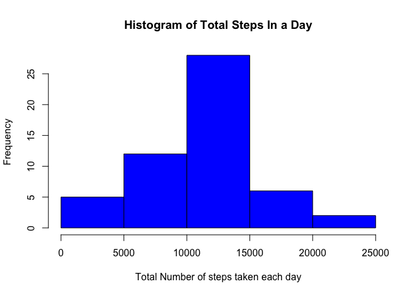
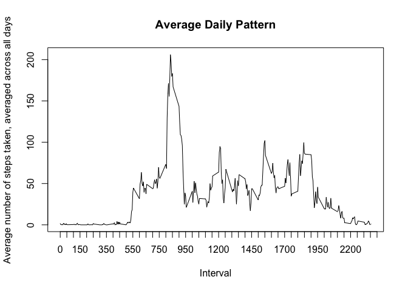
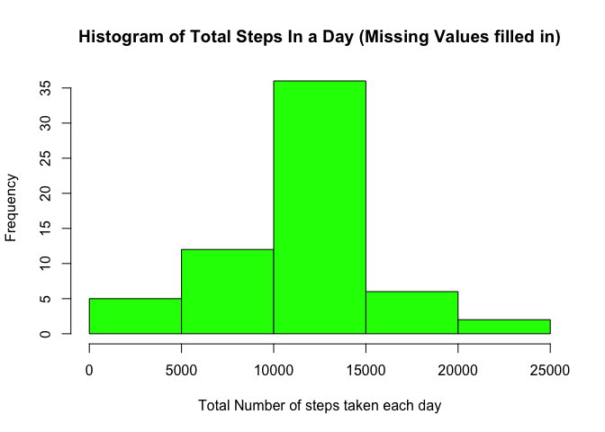
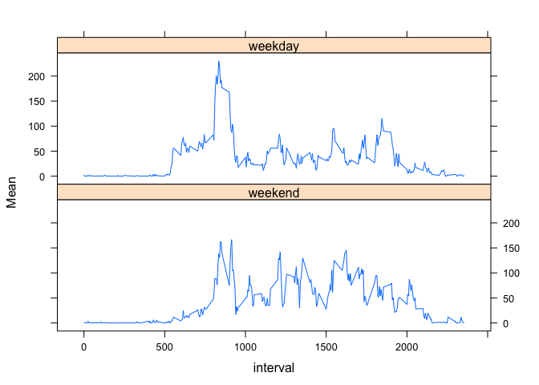

# Reproducible Research: Peer Assessment 1

### Note: In order to show an example of the data being worked on in a current step, I have used the 'head' command in several places below. Also, I have reproduced the questions in the assignment 'as is' to help follow the sequence of code steps.

## Loading and preprocessing the data

Show any code that is needed to

1. Load the data (i.e. read.csv())

2. Process/transform the data (if necessary) into a format suitable for your analysis


```r
activity_file <- read.csv("activity.csv")
# The raw data
head(activity_file)
```

```
##   steps       date interval
## 1    NA 2012-10-01        0
## 2    NA 2012-10-01        5
## 3    NA 2012-10-01       10
## 4    NA 2012-10-01       15
## 5    NA 2012-10-01       20
## 6    NA 2012-10-01       25
```

```r
activity_aggregate <- aggregate(activity_file$steps, list(date = activity_file$date), sum)
# Total number of steps each day
head(activity_aggregate)
```

```
##         date     x
## 1 2012-10-01    NA
## 2 2012-10-02   126
## 3 2012-10-03 11352
## 4 2012-10-04 12116
## 5 2012-10-05 13294
## 6 2012-10-06 15420
```

## What is mean total number of steps taken per day?

1. Make a histogram of the total number of steps taken each day


```r
hist(activity_aggregate$x, xlab="Total Number of steps taken each day", main="Histogram of Total Steps In a Day", col="blue")
```

 

2. Calculate and report the mean and median total number of steps taken per day


```r
meanSteps = mean(activity_aggregate$x, na.rm=TRUE)
medianSteps = median(activity_aggregate$x, na.rm=TRUE)
```

Mean Total number of steps taken per day is 1.0766189\times 10^{4}

Median Total number of steps taken per day is 10765

## What is the average daily activity pattern?

1. Make a time series plot (i.e. type = "l") of the 5-minute interval (x-axis) and the average number of steps taken, averaged across all days (y-axis)


```r
library(plyr)
average_activity <- ddply(activity_file, c("interval"), summarize, AverageSteps=mean(steps , na.rm=TRUE))
# Average number of steps taken averaged across all days
head(average_activity)
```

```
##   interval AverageSteps
## 1        0    1.7169811
## 2        5    0.3396226
## 3       10    0.1320755
## 4       15    0.1509434
## 5       20    0.0754717
## 6       25    2.0943396
```

```r
# I used the axis function to show more x axis ticks. This helps to see visually which 5-minute interval contains the average max number of steps
plot(x <- average_activity$interval, y <- average_activity$AverageSteps, xlab="Interval", ylab="Average number of steps taken, averaged across all days", main="Average Daily Pattern", type = "l", xaxt="n")
axis(1, at = seq(0, 2400, by = 50))
```

 

2. Which 5-minute interval, on average across all the days in the dataset, contains the maximum number of steps?


```r
IntervalWithMaxSteps = subset(average_activity, AverageSteps==max(average_activity$AverageSteps))
IntervalWithMaxSteps
```

```
##     interval AverageSteps
## 104      835     206.1698
```

The 5 minute interval with the max number of steps is 835

## Imputing missing values

1. Calculate and report the total number of missing values in the dataset (i.e. the total number of rows with NAs)


```r
TotalNA = length(activity_file$steps[activity_file$steps=='NA'])
```

The total number of missing values in the dataset is 2304

2. Devise a strategy for filling in all of the missing values in the dataset. The strategy does not need to be sophisticated. For example, you could use the mean/median for that day, or the mean for that 5-minute interval, etc.

3. Create a new dataset that is equal to the original dataset but with the missing data filled in.


```r
#Strategy: Use mean for the 5-minute interval to fill in missing values. This has already been calculated in average_activity
head(activity_file)
```

```
##   steps       date interval
## 1    NA 2012-10-01        0
## 2    NA 2012-10-01        5
## 3    NA 2012-10-01       10
## 4    NA 2012-10-01       15
## 5    NA 2012-10-01       20
## 6    NA 2012-10-01       25
```

```r
head(average_activity)
```

```
##   interval AverageSteps
## 1        0    1.7169811
## 2        5    0.3396226
## 3       10    0.1320755
## 4       15    0.1509434
## 5       20    0.0754717
## 6       25    2.0943396
```

```r
merged_activity_file <- merge(activity_file, average_activity, "interval")
head(merged_activity_file)
```

```
##   interval steps       date AverageSteps
## 1        0    NA 2012-10-01     1.716981
## 2        0     0 2012-11-23     1.716981
## 3        0     0 2012-10-28     1.716981
## 4        0     0 2012-11-06     1.716981
## 5        0     0 2012-11-24     1.716981
## 6        0     0 2012-11-15     1.716981
```

```r
#If values for steps are missing, fill in the value for Average Steps
merged_activity_file[is.na(merged_activity_file$steps) == "TRUE", 2] <- merged_activity_file[is.na(merged_activity_file$steps) == "TRUE", 4]
#activity file with missing fields filled in with average steps for that 5 minute interval
head(merged_activity_file)
```

```
##   interval    steps       date AverageSteps
## 1        0 1.716981 2012-10-01     1.716981
## 2        0 0.000000 2012-11-23     1.716981
## 3        0 0.000000 2012-10-28     1.716981
## 4        0 0.000000 2012-11-06     1.716981
## 5        0 0.000000 2012-11-24     1.716981
## 6        0 0.000000 2012-11-15     1.716981
```

```r
# Next 3 steps are simply to order the dataset by date to restore the sorting order as it appeared in the original dataset activity_file
merged_activity_file$date <- as.character(merged_activity_file$date)
merged_activity_file$date <- as.POSIXct(merged_activity_file$date, format="%Y-%m-%d")
merged_activity_file_sorted_by_date <- merged_activity_file[order(merged_activity_file$date),]
#As can be seen below, the missing values in the 'steps' field of 'activity_file' has been filled in by the value in the 'AverageSteps' field in the 'merged_activity_file_sorted_by_date' dataset
head(activity_file)
```

```
##   steps       date interval
## 1    NA 2012-10-01        0
## 2    NA 2012-10-01        5
## 3    NA 2012-10-01       10
## 4    NA 2012-10-01       15
## 5    NA 2012-10-01       20
## 6    NA 2012-10-01       25
```

```r
#merged_activity_file_sorted_by_date[c("steps", "date", "interval", "AverageSteps")]
head(merged_activity_file_sorted_by_date)
```

```
##     interval     steps       date AverageSteps
## 1          0 1.7169811 2012-10-01    1.7169811
## 63         5 0.3396226 2012-10-01    0.3396226
## 128       10 0.1320755 2012-10-01    0.1320755
## 205       15 0.1509434 2012-10-01    0.1509434
## 264       20 0.0754717 2012-10-01    0.0754717
## 327       25 2.0943396 2012-10-01    2.0943396
```

4. Make a histogram of the total number of steps taken each day and Calculate and report the mean and median total number of steps taken per day. Do these values differ from the estimates from the first part of the assignment? What is the impact of imputing missing data on the estimates of the total daily number of steps?


```r
activity_aggregate_new <- aggregate(merged_activity_file_sorted_by_date$steps, list(date = merged_activity_file_sorted_by_date$date), sum)

#activity_aggregate_new

hist(activity_aggregate_new$x, xlab="Total Number of steps taken each day", main="Histogram of Total Steps In a Day (Missing Values filled in)", col="green")
```

 

```r
mean(activity_aggregate$x, na.rm=TRUE)
```

```
## [1] 10766.19
```

```r
mean(activity_aggregate_new$x, na.rm=FALSE)
```

```
## [1] 10766.19
```

```r
median(activity_aggregate$x, na.rm=TRUE)
```

```
## [1] 10765
```

```r
median(activity_aggregate_new$x, na.rm=FALSE)
```

```
## [1] 10766.19
```
The mean daily number of steps has remained the same after imputing the missing values as 10766.19. However, the median daily number of steps has changed from 10765 to 10766.19 after imputing.

## Are there differences in activity patterns between weekdays and weekends?

1. Create a new factor variable in the dataset with two levels -- "weekday" and "weekend" indicating whether a given date is a weekday or weekend day.


```r
# Create a new column to fill in the day of the week for that date.
merged_activity_file_sorted_by_date$dayOfWeek <- weekdays(merged_activity_file_sorted_by_date$date)
# Duplicate the day of the week column. I did this so that I could overwrite this new column with value 'weekday'/weekend' and compare it to the 'dayOfWeek' column to confirm that it is correct.
merged_activity_file_sorted_by_date$weekdayOrweekend <- merged_activity_file_sorted_by_date$dayOfWeek

head(merged_activity_file_sorted_by_date)
```

```
##     interval     steps       date AverageSteps dayOfWeek weekdayOrweekend
## 1          0 1.7169811 2012-10-01    1.7169811    Monday           Monday
## 63         5 0.3396226 2012-10-01    0.3396226    Monday           Monday
## 128       10 0.1320755 2012-10-01    0.1320755    Monday           Monday
## 205       15 0.1509434 2012-10-01    0.1509434    Monday           Monday
## 264       20 0.0754717 2012-10-01    0.0754717    Monday           Monday
## 327       25 2.0943396 2012-10-01    2.0943396    Monday           Monday
```

```r
# if day is Saturday or Sunday, change value to 'weekend'
merged_activity_file_sorted_by_date[(merged_activity_file_sorted_by_date$weekdayOrweekend == "Saturday" | merged_activity_file_sorted_by_date$weekdayOrweekend == "Sunday") , 6 ] <- "weekend"
# if value is not 'weekend', change it to 'weekday'
merged_activity_file_sorted_by_date[(merged_activity_file_sorted_by_date$weekdayOrweekend != "weekend") , 6 ] <- "weekday"
# convert column type to factor
merged_activity_file_sorted_by_date$weekdayOrweekend <- as.factor(merged_activity_file_sorted_by_date$weekdayOrweekend)
# sample of the dataset with column 'weekday/weekend' added
head(merged_activity_file_sorted_by_date)
```

```
##     interval     steps       date AverageSteps dayOfWeek weekdayOrweekend
## 1          0 1.7169811 2012-10-01    1.7169811    Monday          weekday
## 63         5 0.3396226 2012-10-01    0.3396226    Monday          weekday
## 128       10 0.1320755 2012-10-01    0.1320755    Monday          weekday
## 205       15 0.1509434 2012-10-01    0.1509434    Monday          weekday
## 264       20 0.0754717 2012-10-01    0.0754717    Monday          weekday
## 327       25 2.0943396 2012-10-01    2.0943396    Monday          weekday
```

2. Make a panel plot containing a time series plot (i.e. type = "l") of the 5-minute interval (x-axis) and the average number of steps taken, averaged across all weekday days or weekend days (y-axis). 


```r
# group the new dataset by interval and weekdayOrweekend and take a mean of the steps
average_activity_week <- ddply(merged_activity_file_sorted_by_date, .(interval, weekdayOrweekend), summarize, Mean=mean(steps))
#sample of data to be plotted
head(average_activity_week)
```

```
##   interval weekdayOrweekend       Mean
## 1        0          weekday 2.25115304
## 2        0          weekend 0.21462264
## 3        5          weekday 0.44528302
## 4        5          weekend 0.04245283
## 5       10          weekday 0.17316562
## 6       10          weekend 0.01650943
```

```r
library(lattice)
lattice.options(default.args = list(as.table = TRUE))
xyplot( Mean ~ interval | factor(weekdayOrweekend), data=average_activity_week, type="l", layout = c(1,2))
```

 

As can be seen, there are differences in the activity patterns for weekday and weekend. Weekdays have a higher max average steps per day versus weekend, since the max(Average Total steps) on the y-axis is higher for the weekdays than for weekends. However, the activity levels are more spread out during the weekend.


